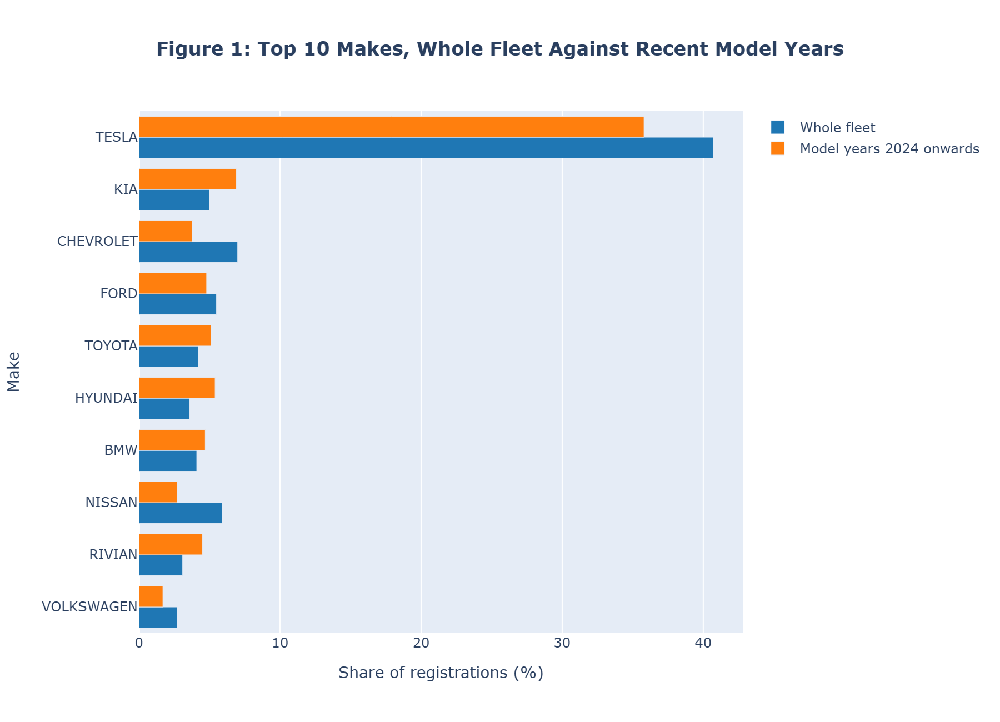
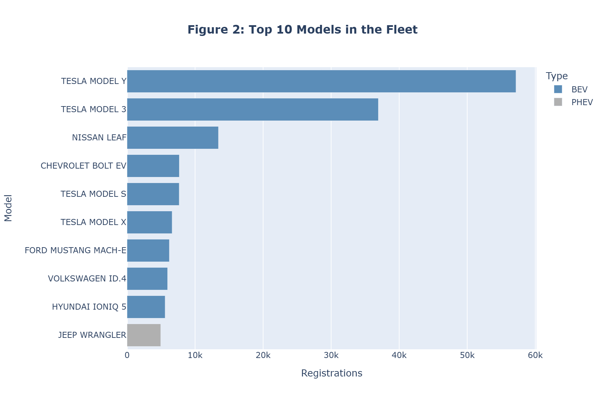
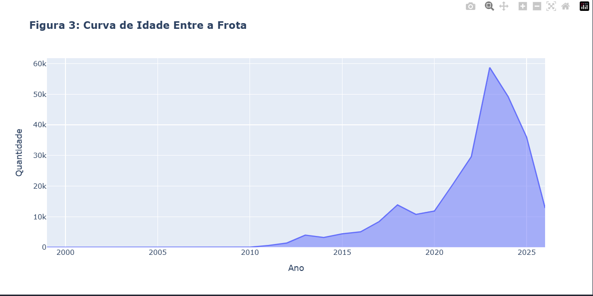
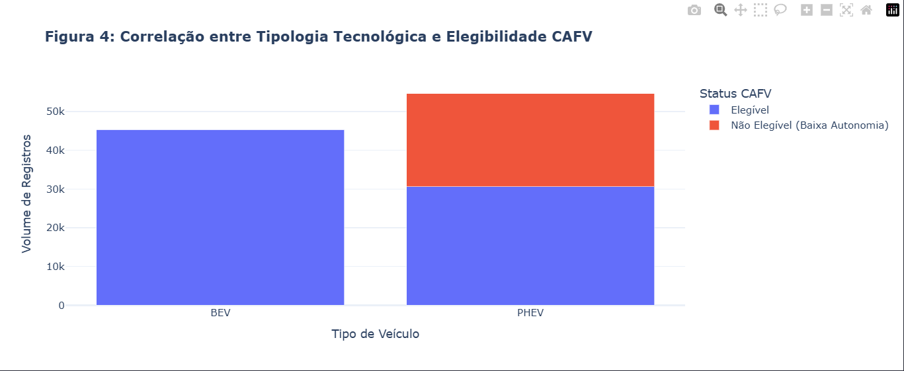
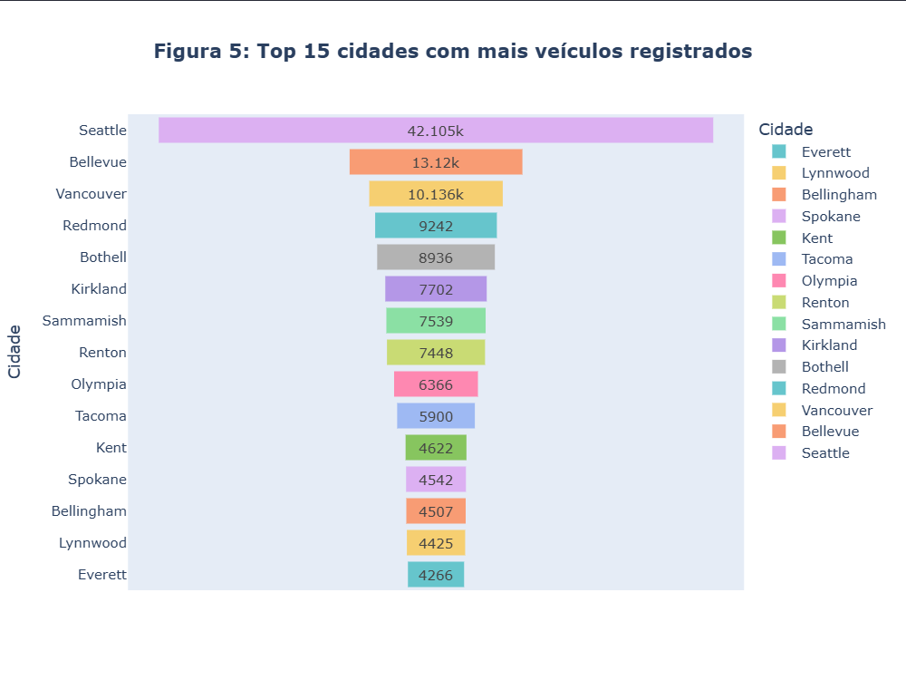
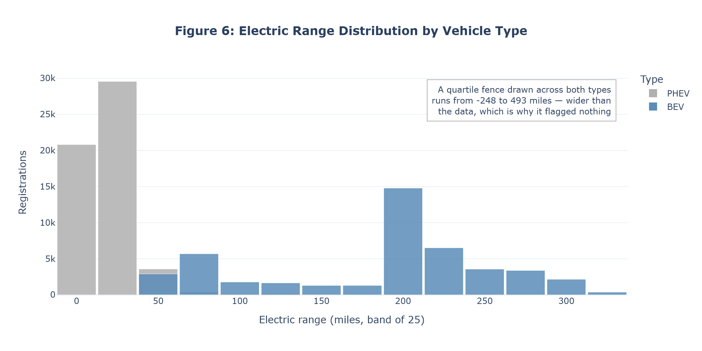
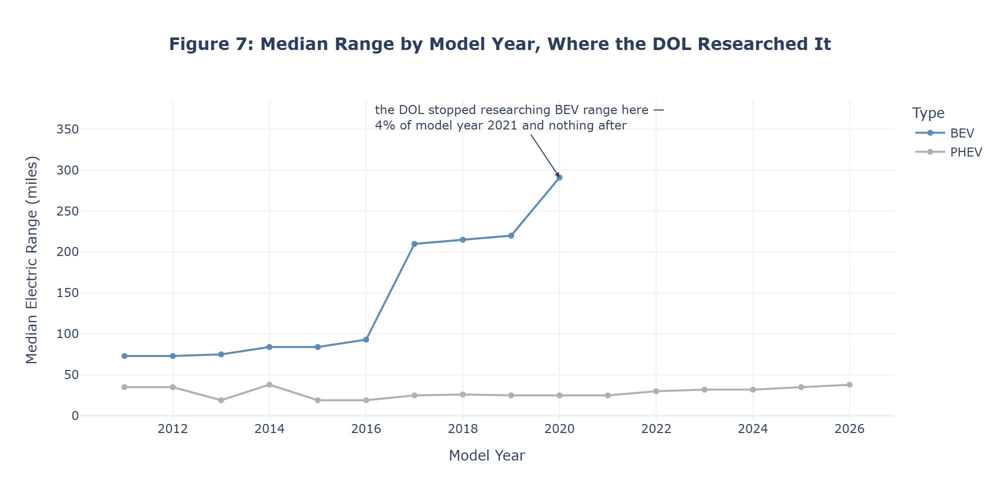
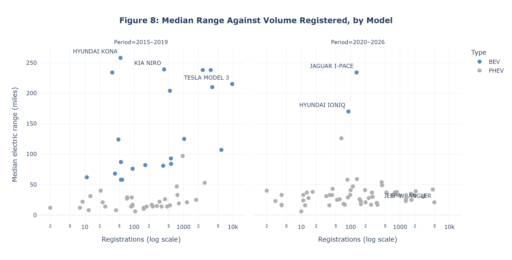
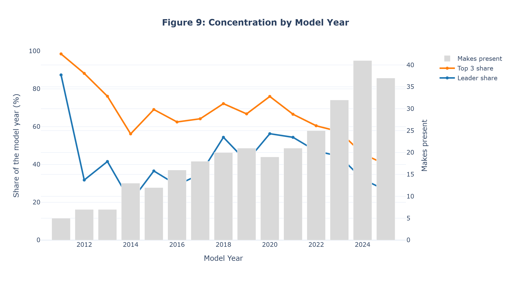

# Electric Vehicle Analysis — Washington State

This project cleans, transforms, plots and explores the data on electric vehicles (BEVs and PHEVs) registered in Washington State. It covers fleet composition, manufacturer share, the evolution of battery range, and where in the state the fleet actually sits.

---

## Data Source

The data is published by the Washington State Department of Licensing (DOL) and is available on the Washington State open data portal: [data.wa.gov](https://data.wa.gov).

The file used is `Electric_Vehicle_Population_Data_20260122.csv`, holding **271,113 records** of electric vehicles registered in the state. It is a frozen snapshot taken on 2026-01-22. The live file is updated continuously, so refreshing it would silently change every count below.

---

## Project Layout

```text
data/raw/          the frozen DOL export, never modified in place
data/processed/    the cleaned export, written by I-cleaning
notebooks/         the narrative; calls into src/, does not duplicate it
src/               cleaning.py, viz.py, utils.py, all reusable logic
tests/             the pytest suite for the pure functions in src/
images/            exported PNGs
```

The analysis is split across two notebooks:

| Notebook | Description |
| --- | --- |
| `I-cleaning.ipynb` | Initial exploration, cleaning and transformation |
| `II-analysis.ipynb` | Visualisations, analysis and insights |

Both are written to run from the repository root, not from `notebooks/`. Locally, `.vscode/settings.json` already points VS Code's Jupyter root at the workspace folder; on Colab and Kaggle, the setup cell at the top of each notebook clones the repository and moves into it. If an import fails, the working directory is wrong.

---

## Questions the Analysis Asks

- How has the adoption of EVs evolved across the years?
- Which makes dominate the fleet?
- How has battery capacity evolved by model year?
- Which cities hold the highest density of electric vehicles?
- What is each manufacturer's real slice of the market, as a percentage?

---

## Cleaning Steps (`I-cleaning.ipynb`)

1. Ten rows holding NaN in fields such as city and county were removed. Against 271,113 rows the loss is negligible.
2. Rows registered outside Washington State were removed, 649 records in all, which keeps the analysis in focus.
3. Any `Electric Range` outside what the row's own vehicle type can reach was replaced with NaN, since it cannot be a measurement of that vehicle. One rule removes three things: the `0` the DOL writes for a battery it has not researched, the `1` carried by 32 model year 2025 Mercedes-Benz plug-ins, and the `29` on 8 rows badged BEV, which is the published figure for the plug-in Hyundai IONIQ. Genuinely low ratings survive, such as the 6 miles of the 2012–2015 Prius Plug-in. A status read off a range that went is dropped with it, so every `CAFV Status` in the export is one the range column still accounts for.
4. Six columns were dropped: `VIN (1-10)`, `State`, `Postal Code`, `Legislative District`, `DOL Vehicle ID` and `2020 Census Tract`. None of them serve the questions above.
5. `Vehicle Location` is kept and parsed into `Longitude` and `Latitude`, because it is what figure 5 is drawn from. The DOL geocodes each registration to the centroid of its postal area rather than to an address, so 270,454 vehicles sit on 825 distinct points; 78 rows carry no location and keep NaN.
6. `Vehicle Age` was created as `2026 - Model Year`, the vehicle's age in years measured against the year of the snapshot.
7. Names were standardised. The `Clean Alternative Fuel Vehicle (CAFV) Eligibility` column was renamed to `CAFV Status` and its values shortened, and the vehicle types were abbreviated to `BEV` and `PHEV`. Three cities the source spells two ways (Sedro-Woolley, Silverlake, McCleary) were collapsed onto one spelling each, which is why the fleet covers 491 cities and not the 494 a naive count reports.
8. `Electric Utility` keeps only the first provider, since the source packs several into one field, and the trailing `- (WA)` and `INC` are stripped from it. `No Known Electric Utility Service` records the absence of a provider rather than a provider, so those 350 rows became NaN, which is why the column holds 19 names and not 20.
9. Outliers were checked with the quartile method (IQR). The ones it finds, such as a 1999 Ford Ranger, were kept, because they are true records inside a dataset that spans 27 years. A separate plausibility check, run against bounds taken from the domain rather than from the distribution, catches what the quartiles structurally cannot.
10. `cleaning.check_export` raises unless the finished frame holds every promise the cleaning makes about it: no range impossible for its own vehicle type, no CAFV ruling left behind by the range it was read off, no vehicle age disagreeing with its model year, no city under two spellings and no empty value in a field that should never be empty.

---

## Analysis and Visualisations (`II-analysis.ipynb`)

### Part II — Fleet Overview

| Figure | Chart | Description |
| --- | --- | --- |
| Fig. 1 | Grouped bars | Top 10 makes: share of the whole fleet against share of model years 2024 onwards |
| Fig. 2 | Horizontal bars | Top 10 individual models, coloured by vehicle type |
| Fig. 3 | Stacked bars | BEV and PHEV share of each model year |
| Fig. 4 | Area | Model year profile of the fleet |
| Fig. 5 | Map | Where the fleet is registered, one bubble per geocoded point, sized by registrations |







CAFV eligibility is not charted. The rule `Electric Range >= 30` explains 100% of the statuses the DOL has ruled on, so the column repeats the range column, and a chart of it would silently show 37% of the fleet.

### Part III — Range and Technological Evolution

| Figure | Chart | Description |
| --- | --- | --- |
| Fig. 6 | Overlaid bars | Range distribution by vehicle type, in bands of 25 miles |
| Fig. 7 | Lines | Median range by model year and type, drawn only where the DOL researched it |
| Fig. 8 | Scatter plot | Median range against volume per model, one panel per period |





Figure 6 comes first because the column holds two populations rather than one: plug-ins sit below 50 miles with a median of 32, battery-electric cars start at 56 and peak between 200 and 225 with a median of 215. It is also why the quartile test in the cleaning notebook found nothing. Pooled across both types, the fence runs from -248 to 493 miles, wider than the data itself.

Figure 7 answers the question directly and shows what the file cannot answer: the BEV line stops at model year 2020, because from 2021 on the DOL researched the range of 4% of them and then none at all, while plug-in coverage stays at 100% throughout. Figure 8 then sets registrations against the median range per model, with a panel per period. Only models with researched coverage appear, so that both axes of a point describe the same vehicles, which is why the 2020 – 2026 panel holds 17% of that window's registrations and, of its 61 models, 59 plug-in hybrids against 2 battery-electric cars.

### Part IV — Market Share

| Figure | Chart | Description |
| --- | --- | --- |
| Fig. 9 | Lines and bars | Leader share, top-three share and number of makes present, by model year |



The table of every make's share of the fleet stays, and figure 9 is what stops it being read as the present tense: concentration peaked at model year 2020 and has fallen every year since, while the number of makes on sale nearly doubled. I removed the treemap that used to sit here, because it repeated figure 1's top ten in the same order, and rounding each share to one decimal gave twelve real makes an area of zero.

---

## The Columns

Below are the columns of the original dataset. The ~~struck through~~ ones were removed during cleaning; the **bold** ones were used in the analysis.

| Original Column | Status | Description |
| --- | --- | --- |
| ~~VIN (1-10)~~ | Removed | The vehicle's chassis number |
| **County** | Kept | County the vehicle is registered in |
| **City** | Kept | City the vehicle is registered in |
| ~~State~~ | Removed | State (all of them Washington) |
| ~~Postal Code~~ | Removed | Postal code |
| **Model Year** | Kept | Year the vehicle was built |
| **Make** | Kept | Manufacturer |
| **Model** | Kept | Model of the vehicle |
| **Electric Vehicle Type** | Kept | Type: BEV (fully electric) or PHEV (plug-in hybrid) |
| ~~Clean Alternative Fuel Vehicle (CAFV) Eligibility~~ → **CAFV Status** | Renamed | Eligibility for the tax incentive (requires a range of ≥ 30 miles / ~48 km) |
| **Electric Range** | Kept | Range in miles on a charged battery |
| ~~Legislative District~~ | Removed | Legislative district code |
| ~~DOL Vehicle ID~~ | Removed | Registration id at the Department of Licensing |
| **Vehicle Location** → **Longitude** / **Latitude** | Parsed | The coordinates the DOL geocoded the registration to, split into two numeric columns |
| **Electric Utility** | Kept | Electricity provider associated with the vehicle |
| ~~2020 Census Tract~~ | Removed | Census tract identifier |
| **Vehicle Age** *(created)* | New | The vehicle's age in years (`2026 - Model Year`) |

---

## Libraries Used

| Library | Use | Documentation |
| --- | --- | --- |
| pandas | Data manipulation and analysis | [pandas.pydata.org](https://pandas.pydata.org/docs/) |
| NumPy | Numeric operations and type handling | [numpy.org](https://numpy.org/doc/2.4/) |
| Plotly Express | Interactive visualisations | [plotly.com/python](https://plotly.com/python/) |
| Matplotlib | Auxiliary visual support | [matplotlib.org](https://matplotlib.org/stable/index.html) |

---

## A Note on the Charts

Plotly draws interactive charts in the notebook: they can be zoomed, filtered and explored directly. That is also why the figures may fail to render when the notebooks are viewed on GitHub.

The static images above are exported from the notebook itself, by its last cell, so they cannot drift from the analysis that produced them. They live in `images/`. Run the notebooks locally, on Google Colab or on Kaggle for the interactive versions.

> Watch out for the map (Fig. 5) and the scatter plot (Fig. 8). Both lose real information once flattened to PNG, and the map in particular is worth panning and hovering. Figure 8 labels its extremes precisely, so that the flattened version still says something.

## A Note on the Dataset

The raw export is committed to the repository, in `data/raw/`. New data is added to the live file continuously, so re-downloading it would change the counts throughout the analysis; the version frozen on the day it was downloaded is the one analysed here.

---

## Technical References

Each convention in this repository is borrowed from a source that argues for it.

| Reference | Author | What it informed here |
| --- | --- | --- |
| *Software Engineering for Data Scientists* | Catherine Nelson | Repository layout (`src/`, `notebooks/`, `tests/`), testing the pure transformations, linting and formatting as a definition of done |
| *Python for Data Analysis*, 3rd edition | Wes McKinney | pandas idiom: reshaping with `melt`, `groupby` aggregation, missing-data handling |

Library documentation was the reference of record for API behaviour, in preference to secondhand summaries:
[pandas](https://pandas.pydata.org/docs/), [NumPy](https://numpy.org/doc/2.4/), [matplotlib](https://matplotlib.org/stable/index.html), [plotly](https://plotly.com/python/), [ruff](https://docs.astral.sh/ruff/), [pytest](https://docs.pytest.org/).

Claude Opus 5 (Anthropic) was used as a working assistant throughout: interpreting the data, pressure-testing conclusions, and reviewing code. I verified every finding it surfaced against the dataset before writing it down. The figures quoted in this README and in the notebooks are measured, not asserted.
